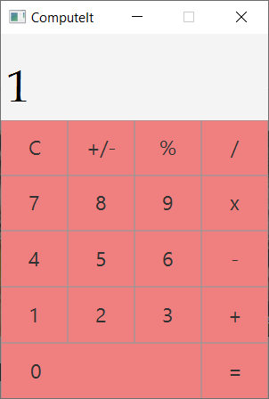

# ComputeIt
A basic Calculator Kotlin Application made using the power of Kotlin syntax and benefits. This Project is a part of "30 Days of Kotlin" Campaign.

Summary of Development : 

  -Followed the Kotlin Bootcamp for Programmers Codelab
  
  -Created in IntelliJ IDEA
  
  -Used basics of Kotlin syntax
  
  -Used power of Kotlin such as :
    -sealed class, abstract class, lambda expressions, init blocks, overrided functions, visibility modifiers, everything is an value
    
Used TornadoFx : JavaFx Framework for Kotlin for UI and Styling

Requirements :

  -IntelliJ IDEA
  
  -JVM
  
  -TornadoFx plugin for IntelliJ IDEA

